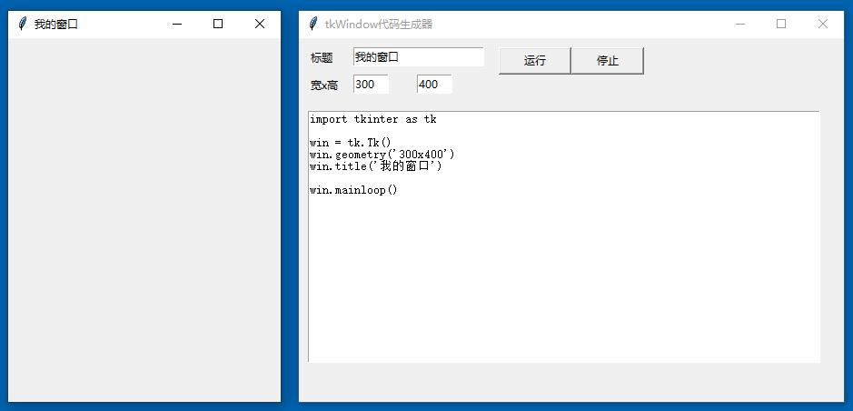

# pyGUItest

2021年4月21日21:00:17

最近开始迷上Python的Tkinter开发基础的GUI程序。这是整个学习过程中的源文件和记录。如果能够开发出一些有趣的东西，那就更不错了。

## tkWindow.py
是一个基于tkinter的GUI程序，实现第一个用可视化窗体程序生成并调试基于tkinter的可视化窗体。这是一个最基础，但是非常有意义的尝试。

## Python代码辅助生成工具计划

如果可以的话，在接下来的时间，我将尝试基于Python + Tkinter 以及VScode + GitHub，不断的开发多种多样的Python代码辅助工具，算是一边学习，一边实践，一边掌握。无果能做出有用的东西，那是最好的。

